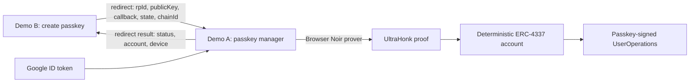

# zkAccount

**Recover the same ERC-4337 smart account from any app with Google—without revealing the Google account onchain or trusting an application backend.**

zkAccount is a Sepolia-testnet MVP for portable smart accounts. A Google ID token is verified inside a Noir zero-knowledge circuit in the browser. The resulting proof resolves a deterministic account and authorizes an app-specific WebAuthn P-256 credential. After that one-time bootstrap, every normal transaction is signed by a fresh user-verified passkey assertion and does not require another Google proof.

Google authorization is centralized in a single app, Demo A, which is the only configured Google OAuth client and doubles as a Google-backed passkey management portal. Any other app creates its passkey locally, then redirects to Demo A to authorize it with Google; the requesting app never sees the Google ID token or the OAuth client secret.

The repository includes the complete path: two demo apps, browser proving, an SDK, ERC-4337 contracts, the generated UltraHonk verifier, legacy Base Sepolia deployment metadata, and a Chainlink CRE workflow for Google key rotation.

> **MVP status:** account derivation, browser proof generation, native WebAuthn verification, cross-app redirect authorization, device authorization, and UserOperation construction are implemented and tested. The current stack is deployed and its `GoogleKeyRegistry` populated on both Base Sepolia and Ethereum Sepolia (see [current deployments](#deploy-the-current-contract-stack)). Live transactions also require an EntryPoint v0.8 bundler. See [MVP constraints](#mvp-constraints).

## The demo

Demo A is the sole Google OAuth client and passkey manager; Demo B never sees a Google ID token:

1. **Demo B** creates a passkey on its own origin, then redirects to Demo A with its RP ID, public key, a callback URL, a one-time state value, and the chain ID.
2. **Demo A** validates the request, shows the requesting origin, RP ID, device address, chain, and action before doing anything, authenticates with Google, generates a ZK proof locally, and submits the add-device UserOperation. It never redirects automatically—it shows the approved, rejected, or failed result first, with an explicit link back to Demo B.
3. **Demo B** verifies the authorization onchain before saving the wallet, then acts as a Base Sepolia or Ethereum Sepolia web wallet for AppKit and other WalletConnect dapps.
4. Demo A also works as a standalone dashboard: resolve any account with Google, list its authorized devices by cleartext RP ID, and revoke one with a fresh Google authorization—no local passkey required.
5. Both apps derive the **same smart-account address** from the same private Google identity, and either authorized device can send an ERC-4337 transaction or revoke itself locally.

This demonstrates identity portability without exporting a seed phrase, sharing local storage, or sending the Google JWT to more than one, deliberately chosen application.



## What the MVP proves

- Google signed an RS256 OIDC token for a hidden `sub`.
- The token has the expected issuer, algorithm, audience, nonce, issued-at time, and expiry.
- The nonce binds authorization to one action, device address, chain, factory, and ten-minute proof window. The circuit can attest either an add-device or remove-device action, but `GoogleAccount` only ever accepts the add-device one—removing a device requires a UserOp signed by an already-authorized device.
- The private Google identity maps to the same Poseidon2 commitment—and therefore the same CREATE2 account—across independent apps.
- The proof's audience matches the factory's immutable root Google OAuth client; no other client can authorize devices.
- The signing key belongs to the CRE-managed set of current Google JWKs.

Only nine field elements are public: the identity commitment, audience hash, device address, chain ID, factory address, authorization expiry, Google key commitment, the JWT issued-at time used as the account's monotonic Google nonce, and the add/remove action discriminator. The JWT and Google subject remain private.

## Run the MVP

### 1. Install the toolchain

[Nix](https://nixos.org/) is the easiest path because the flake pins Node.js 22, Foundry, Nargo `1.0.0-beta.26`, Barretenberg `5.2.0`, Bun, and the CRE CLI.

```sh
nix develop
npm install
```

Without Nix, install Node.js 22+ and use the pinned Nargo and Barretenberg versions above. Foundry is only required for Solidity tests.

### 2. Configure the demo origins

Use the project's audience-matched Google OAuth web client, or deploy a factory with your own root Google OAuth client ID. The factory derives its immutable `rootAudience` as the low-248 SHA-256 hash of that client ID. Demo A is the only app that needs a configured OAuth client—allow its origin on that client:

- `http://localhost:5173` for Demo A

Then configure each app:

```sh
cp apps/demo-a/.env.example apps/demo-a/.env.local
cp apps/demo-b/.env.example apps/demo-b/.env.local
```

Demo A (the Google client and passkey manager):

```dotenv
VITE_GOOGLE_CLIENT_ID=your-client-id.apps.googleusercontent.com
VITE_BASE_SEPOLIA_FACTORY=your-base-sepolia-factory
VITE_BASE_SEPOLIA_FACTORY_DEPLOYMENT_BLOCK=45976355
VITE_BASE_SEPOLIA_RPC_URL=https://sepolia.base.org
VITE_BASE_SEPOLIA_BUNDLER_URL=https://your-base-sepolia-bundler.example/rpc
VITE_ETHEREUM_SEPOLIA_FACTORY=your-ethereum-sepolia-factory
VITE_ETHEREUM_SEPOLIA_FACTORY_DEPLOYMENT_BLOCK=11568847
VITE_ETHEREUM_SEPOLIA_RPC_URL=https://ethereum-sepolia-rpc.publicnode.com
VITE_ETHEREUM_SEPOLIA_BUNDLER_URL=https://your-ethereum-sepolia-bundler.example/rpc
```

Demo B (no Google client; it redirects to Demo A instead):

```dotenv
VITE_PASSKEY_MANAGER_URL=http://localhost:5173/
VITE_BASE_SEPOLIA_FACTORY=your-base-sepolia-factory
VITE_BASE_SEPOLIA_FACTORY_DEPLOYMENT_BLOCK=45976355
VITE_BASE_SEPOLIA_RPC_URL=https://sepolia.base.org
VITE_BASE_SEPOLIA_BUNDLER_URL=https://your-base-sepolia-bundler.example/rpc
VITE_ETHEREUM_SEPOLIA_FACTORY=your-ethereum-sepolia-factory
VITE_ETHEREUM_SEPOLIA_FACTORY_DEPLOYMENT_BLOCK=11568847
VITE_ETHEREUM_SEPOLIA_RPC_URL=https://ethereum-sepolia-rpc.publicnode.com
VITE_ETHEREUM_SEPOLIA_BUNDLER_URL=https://your-ethereum-sepolia-bundler.example/rpc
# Create a wallet project at https://dashboard.walletconnect.com
VITE_REOWN_PROJECT_ID=your-walletconnect-project-id
```

Both apps must agree on the same factory per chain—Demo A submits the authorization UserOperation for devices Demo B creates. The current, compatible factories are recorded in `deployments/base-sepolia-current.json` and `deployments/ethereum-sepolia.json` (see [Deploy the current contract stack](#deploy-the-current-contract-stack)); `deployments/base-sepolia.json` is an older, incompatible deployment. A custom OAuth client requires a correspondingly configured fresh deployment. The bundler must support EntryPoint v0.8, and the chain must expose the P-256 verifier at `0x100`.

### 3. Start both apps

```sh
npm run dev:a
```

```sh
npm run dev:b
```

Open Demo B, choose a network, and click **Create passkey**. It creates a WebAuthn credential locally, then redirects to Demo A with the request. Review the callback host, RP ID, device address, and chain on Demo A, authenticate with Google, and let the browser generate the proof. Fund the displayed counterfactual account with the selected network's Sepolia ETH before the ten-minute proof expires, then submit the authorization. Demo A never redirects automatically—use the explicit **Return to requesting app** link once the result is shown.

After authorization, Demo B stores the public account address, factory, chain ID, credential ID, P-256 coordinates, and RP ID hash. On a return visit it reloads that public metadata and checks the onchain authorization without requiring Google again. Private keys remain inside the authenticator; Google tokens and proofs never leave Demo A.

To use Demo B as a wallet, open an AppKit dapp's WalletConnect flow and configure Demo B as a custom web wallet with the URL `http://localhost:5174/wc`. AppKit opens `?uri=wc:...`; Demo B also accepts a copied WalletConnect URI manually. It advertises only the currently selected chain—Base Sepolia (`eip155:84532`) or Ethereum Sepolia (`eip155:11155111`)—and supports `eth_sendTransaction`, `personal_sign`, and `eth_signTypedData_v4`. Disconnect active sessions before changing networks. Every connection and request requires explicit approval, and every transaction or message signature opens a fresh passkey prompt.

## How it works

### Browser and SDK

`@zkaccount/sdk` handles Google Identity Services, nonce construction, ES256 passkey registration and assertion encoding, identity commitments, threaded bb.js proving, account prediction, EntryPoint v0.8 UserOperations, and the cross-app redirect protocol (`packages/sdk/src/redirect.ts`). Demo B uses Reown WalletKit for encrypted WalletConnect sessions and request delivery. The full ID token stays on Demo A's page and is never logged, sent to another app, or sent to a zkAccount backend.

The redirect protocol carries `rpId`, `publicKey`, `callback`, `state`, and `chainId` as query parameters. The manager requires the callback to be HTTPS (or HTTP `localhost`/loopback for local development) with no credentials or fragment, and requires the callback's hostname to exactly equal the requested RP ID—an app cannot request authorization for a passkey bound to a different origin. The result is returned by appending `zkaccount_status`, `zkaccount_state`, `zkaccount_chain_id`, `zkaccount_account`, `zkaccount_device`, and an optional `zkaccount_error` to the callback, preserving any query parameters the callback already had. The requesting app must treat its locally generated `state` as one-time, verify the returned `state` matches it, and independently check onchain that the returned device is actually authorized before trusting the result.

The SDK accepts discoverable ES256 credentials only. It extracts and stores public metadata after registration, uses the final UserOperation or ERC-1271 digest as the WebAuthn challenge, parses and normalizes the authenticator's DER P-256 signature, and never exports or derives a private key.

### Circuit

The Noir circuit reconstructs the JWT signing input, verifies the 2048-bit RSA/PKCS#1 v1.5 SHA-256 signature, checks the OIDC claims and login nonce, exposes the signed `iat` as a monotonic Google authorization nonce, derives a private Poseidon2 identity commitment, and commits to the Google RSA key. The nonce binds an action discriminator—add or remove a device—so a proof authorized for one action or device cannot be replayed for another. The generated Solidity UltraHonk verifier is tested against a real fixture proof.

The nine public inputs are ordered as identity commitment, audience hash, device address, chain ID, factory address, authorization expiry, Google key commitment, `iat`-backed Google nonce, and the action (`1` = add device, `2` = remove device).

### Smart account

`GoogleAccountFactory` deterministically deploys one account per identity commitment, and pins an immutable `rootAudience` derived from its configured Google OAuth client ID at construction—there is no per-account audience administration, so only that one client can ever authorize devices. `GoogleAccount` supports two ERC-4337 signature modes:

- `0x01`: a short-lived Google proof that can execute exactly one proof-bound `queueDevice` self-call to add a device (the validator rejects any other action, so a remove-device proof cannot authorize a call this way);
- `0x00`: a canonical WebAuthn assertion from an authorized P-256 credential for subsequent operations.

`addDevice` takes a cleartext RP ID string, derives its SHA-256 hash onchain, and emits it in the `DeviceSet` event; the SDK reconstructs each account's current, labeled device set purely from event logs (`Google4337Client.listAuthorizedDevices`), without storing duplicate RP ID strings in contract state.

The account verifies the assertion type and challenge, RP ID hash, user-presence and user-verification flags, backup-flag consistency, and P-256 signature through the native `0x100` precompile. It also implements ERC-1271: personal-message and EIP-712 requests return the same canonical WebAuthn envelope that `isValidSignature` accepts only while that credential remains authorized. Demo B does not advertise raw transaction signing, WalletConnect-driven chain switching, or batch calls.

Anyone may deploy a counterfactual account, but deployment grants no authority. Racing `createAccount(identity)` cannot install an attacker's key.

Each account consumes a strictly increasing Google nonce during validation. If two Google logins carry the same one-second `iat`, only the first can authorize or revoke a device; the SDK asks the loser to sign in again for a fresh authorization.

### Google key rotation

Google's signing keys are not manually administered. The scheduled Chainlink CRE workflow fetches Google's JWKS independently across DON nodes, requires identical normalized results, and atomically replaces the onchain key set through the authenticated Keystone forwarder. Keys absent from the new report are revoked.

## Repository map

| Path                                    | Purpose                                                                  |
| --------------------------------------- | ------------------------------------------------------------------------ |
| `apps/demo-a`                           | Google OAuth client, passkey authorization manager, and device dashboard |
| `apps/demo-b`                           | Dual-Sepolia passkey wallet that redirects to Demo A for authorization   |
| `packages/sdk`                          | Browser auth/proving, passkeys, account helpers, and ERC-4337 client     |
| `circuits/google_jwt`                   | Noir JWT/RS256 authorization circuit and generated artifacts             |
| `contracts/src`                         | Account, factory, policy validator, key registry, and generated verifier |
| `contracts/test`                        | Foundry policy tests plus real-proof verifier fixtures                   |
| `cre/google-jwks`                       | Scheduled Chainlink CRE Google JWKS consensus workflow                   |
| `deployments/base-sepolia-current.json` | Current Base Sepolia deployment metadata                                 |
| `deployments/ethereum-sepolia.json`     | Current Ethereum Sepolia deployment metadata                             |
| `deployments/base-sepolia.json`         | Historical pre-WebAuthn Base Sepolia deployment metadata                 |

## Deploy the current contract stack

The native-WebAuthn account bytecode changes every counterfactual account address, so the demos require a fresh factory. `contracts/script/Deploy.s.sol` deploys to one chain at a time; `contracts/script/DeployAll.s.sol` deploys the same stack to Base Sepolia and Ethereum Sepolia in a single run, forking each chain in turn. Both simulate by default and broadcast only when `--broadcast` is explicitly supplied. Local simulation needs `evm_version = "prague"` (set in `foundry.toml`) since Foundry's local EVM only models the RIP-7212/EIP-7951 P-256 precompile at `0x100` under that spec, even though both target chains already support it live under any configured version.

```sh
export ENTRY_POINT=0x4337084D9E255Ff0702461CF8895CE9E3b5Ff108
export ROOT_GOOGLE_CLIENT_ID=your-client-id.apps.googleusercontent.com
export CRE_WORKFLOW_OWNER=0x...
export BASE_SEPOLIA_RPC_URL=https://sepolia.base.org
export BASE_SEPOLIA_CRE_FORWARDER=0x...
export ETHEREUM_SEPOLIA_RPC_URL=https://ethereum-sepolia-rpc.publicnode.com
export ETHEREUM_SEPOLIA_CRE_FORWARDER=0x...

# Read-only simulation (both chains)
forge script contracts/script/DeployAll.s.sol:DeployAll --rpc-url "$BASE_SEPOLIA_RPC_URL" --sender 0x... -vvv

# Intentional live deployment (both chains)
forge script contracts/script/DeployAll.s.sol:DeployAll --rpc-url "$BASE_SEPOLIA_RPC_URL" --account your-keystore --sender 0x... --broadcast --slow -vvv
```

The current deployment was broadcast at Base Sepolia block `45976355`:

| Contract                | Current address                                                                                                                 |
| ----------------------- | ------------------------------------------------------------------------------------------------------------------------------- |
| GoogleAccountFactory    | [`0x8E56a8269930a040265e943aB47377f6e8E34c9f`](https://sepolia.basescan.org/address/0x8E56a8269930a040265e943aB47377f6e8E34c9f) |
| GoogleJWTValidator      | [`0x00D1893e6A4e1d55d1B0D3cDEa9d405D25dD4FB9`](https://sepolia.basescan.org/address/0x00D1893e6A4e1d55d1B0D3cDEa9d405D25dD4FB9) |
| GeneratedGoogleVerifier | [`0xe8a7cdbb216C08c2905218aF8FF82A869DbB0938`](https://sepolia.basescan.org/address/0xe8a7cdbb216C08c2905218aF8FF82A869DbB0938) |
| GoogleKeyRegistry       | [`0x8f5F3686cF7297C0D338b1b3981561E14c7bA0bf`](https://sepolia.basescan.org/address/0x8f5F3686cF7297C0D338b1b3981561E14c7bA0bf) |

The Ethereum Sepolia deployment was broadcast at block `11568847`:

| Contract                | Current address                                                                                                                 |
| ----------------------- | ------------------------------------------------------------------------------------------------------------------------------- |
| GoogleAccountFactory    | [`0x4062F19cFA4c60770B800c6a7987F4c76df568bF`](https://sepolia.etherscan.io/address/0x4062F19cFA4c60770B800c6a7987F4c76df568bF) |
| GoogleJWTValidator      | [`0xe86a093F34A253A9b704Ea0a3729f688a6984faf`](https://sepolia.etherscan.io/address/0xe86a093F34A253A9b704Ea0a3729f688a6984faf) |
| GeneratedGoogleVerifier | [`0x8e9d5c4BD0b4515c422D291274569a685C98e5F0`](https://sepolia.etherscan.io/address/0x8e9d5c4BD0b4515c422D291274569a685C98e5F0) |
| GoogleKeyRegistry       | [`0xE952bbAFd809D20636d16F520EEB65854D5A60D5`](https://sepolia.etherscan.io/address/0xE952bbAFd809D20636d16F520EEB65854D5A60D5) |

Both `GoogleKeyRegistry` contracts were populated with four Google signing keys via `cre workflow simulate --broadcast` against the CRE tenant's mock Keystone forwarder on each chain. This is a testnet simulation, not a production DON-attested report. Full addresses and simulation metadata are recorded in `deployments/base-sepolia-current.json` and `deployments/ethereum-sepolia.json`.

For a future redeployment, record the emitted addresses after broadcast, set the new factory in both demos, configure the CRE workflow for the new registry, and populate the registry before attempting Google bootstrap. Never commit the deployer key or live OAuth credentials.

## Legacy Base Sepolia deployment

The addresses below predate the `iat`-backed Google nonce and are retained as historical deployment metadata. Do not configure the current demos with this factory; deploy the current verifier, validator, registry, and factory stack first.

| Contract                | Address                                                                                                                         |
| ----------------------- | ------------------------------------------------------------------------------------------------------------------------------- |
| EntryPoint v0.8         | [`0x4337084D9E255Ff0702461CF8895CE9E3b5Ff108`](https://sepolia.basescan.org/address/0x4337084D9E255Ff0702461CF8895CE9E3b5Ff108) |
| GoogleAccountFactory    | [`0x5C567AbFc1805094943A7F153381EB38845580B6`](https://sepolia.basescan.org/address/0x5C567AbFc1805094943A7F153381EB38845580B6) |
| GoogleJWTValidator      | [`0x6665ee4A35417306C0D37F80B694DdDEc53E1723`](https://sepolia.basescan.org/address/0x6665ee4A35417306C0D37F80B694DdDEc53E1723) |
| GeneratedGoogleVerifier | [`0x28D6a6FECd61864Ee00C9C44Ac607A31b13Ed52f`](https://sepolia.basescan.org/address/0x28D6a6FECd61864Ee00C9C44Ac607A31b13Ed52f) |
| GoogleKeyRegistry       | [`0xb17650A640EdA09E9A36AF3bb6ac1e28Da5A3D34`](https://sepolia.basescan.org/address/0xb17650A640EdA09E9A36AF3bb6ac1e28Da5A3D34) |

Deployment metadata, including transaction hashes and the configured root audience, lives in [`deployments/base-sepolia.json`](deployments/base-sepolia.json).

## Verify the repository

Run the full local validation suite from the Nix development shell:

```sh
forge test -vv
npm run circuit:fixture
npm run circuit:test-negative
npm run circuit:generate-verifier
npm run circuit:test-bbjs
npm run sdk:test
npm test -w @zkaccount/demo-b
npm run check:p256
npm run typecheck
npm ci --prefix cre/google-jwks
npm run typecheck:cre
npm run build
```

The circuit currently expands to 262,021 Barretenberg gates, just below the 2^18 proving-domain boundary. Set `BBJS_THREADS` to benchmark a specific worker count.

## Security model

The system still trusts Google account security, Google and the configured CRE/DON path for key rotation, frontend integrity, the selected ERC-4337 infrastructure, and the correctness of the circuit and generated verifier.

It does **not** require a project backend to receive the JWT, attest account ownership, custody keys, or sign UserOperations. Integrating an app also does not automatically grant that app authority over the account.

The circuit intentionally accepts a constrained MVP subset: compact JSON claims, a single string `aud`, RS256, 2048-bit RSA with exponent 65537, headers up to 96 bytes, payloads up to 735 bytes, audiences up to 128 bytes, and subjects up to 64 bytes.

## MVP constraints

- A fixture Google-proof validation consumes about 754k gas, and direct account creation about 888k gas.
- There is no paymaster. The counterfactual account must hold the selected network's Sepolia ETH before its first UserOperation.
- The registry starts empty and accepts bootstrap proofs only after a successful authenticated CRE report. Google key rotation can briefly precede the next scheduled six-hour update.
- Cross-origin isolation enables threaded browser proving. Production hosts must send `Cross-Origin-Opener-Policy: same-origin` and `Cross-Origin-Embedder-Policy: require-corp`; otherwise bb.js falls back to one thread.
- Native device and ERC-1271 signatures require an ES256-capable authenticator and a chain exposing the EIP-7951/RIP-7212 P-256 precompile at `0x100`; there is no Solidity verification fallback.

The next milestone is a recorded live portability run across both demo origins, followed by further verifier and proving-performance optimization.

## CRE workflow

Set the deployed registry address and workflow identity in `cre/google-jwks/config.staging.json`. From the repository root inside the Nix development shell, install the workflow dependencies and run a read-only simulation:

```sh
npm ci --prefix cre/google-jwks
cre workflow simulate google-jwks \
  --project-root cre \
  --target staging-settings \
  --config config.staging.json
```

To publish the simulated report to the testnet selected in `cre/project.yaml` through its configured mock forwarder, decrypt the local Foundry keystore only for the lifetime of the command and add `--broadcast`:

```sh
CRE_ETH_PRIVATE_KEY=$(cast wallet --json decrypt-keystore zkaccount-deployer --unsafe-password "" | tail -c 67) \
  cre workflow simulate google-jwks \
    --project-root cre \
    --target staging-settings \
    --config config.staging.json \
    --broadcast
```

The `zkaccount-deployer` keystore currently has an empty password. The broadcasting account must hold enough ETH on the selected testnet for the mock-forwarder transaction. `--broadcast` changes real testnet state, but the report is produced by the local single-node simulator and must not be treated as a production DON-attested report. A production deployment must use the production Keystone forwarder and `cre workflow deploy` after deployment access is enabled.

Never commit live ID tokens, OAuth secrets, device private keys, or prover inputs derived from a real token.
