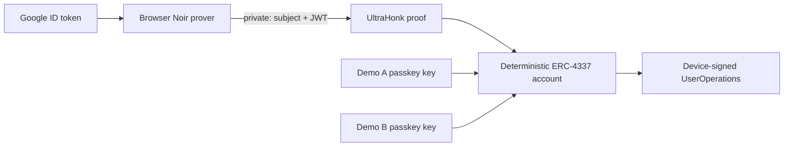

# zkAccount

**Recover the same ERC-4337 smart account from any app with Google—without revealing the Google account onchain or trusting an application backend.**

zkAccount is a Base Sepolia MVP for portable smart accounts. A Google ID token is verified inside a Noir zero-knowledge circuit in the browser. The resulting proof resolves a deterministic account and authorizes an app-specific, passkey-derived device key. After that one-time bootstrap, normal transactions use the device key and do not require another Google proof.

The repository includes the complete path: two independent demo apps, browser proving, an SDK, ERC-4337 contracts, the generated UltraHonk verifier, legacy Base Sepolia deployment metadata, and a Chainlink CRE workflow for Google key rotation.

> **MVP status:** account derivation, browser proof generation, contract verification, device authorization, and UserOperation construction are implemented and tested. The live end-to-end transaction currently requires a Base Sepolia EntryPoint v0.8 bundler with relaxed ERC-7562 validation limits. See [MVP constraints](#mvp-constraints).

## The demo

The two apps deliberately share no browser state:

1. **Demo A** creates or unlocks a passkey, authenticates with Google, generates a ZK proof locally, and authorizes Demo A's device key.
2. **Demo B** repeats the flow from a separate origin with a separate passkey-derived key.
3. Both apps derive the **same smart-account address** from the same private Google identity.
4. Either authorized device can send an ERC-4337 transaction, manage devices, or revoke itself. Demo A can also manage approved Google OAuth audiences.

This demonstrates identity portability without exporting a seed phrase, sharing local storage, or sending the Google JWT to a project server.



## What the MVP proves

- Google signed an RS256 OIDC token for a hidden `sub`.
- The token has the expected issuer, algorithm, audience, nonce, issued-at time, and expiry.
- The nonce binds authorization to one device address, chain, factory, and ten-minute proof window.
- The private Google identity maps to the same Poseidon2 commitment—and therefore the same CREATE2 account—across independent apps.
- The signing key belongs to the CRE-managed set of current Google JWKs.

Only eight field elements are public: the identity commitment, audience hash, device address, chain ID, factory address, authorization expiry, Google key commitment, and the JWT issued-at time used as the account's monotonic Google nonce. The JWT and Google subject remain private.

## Run the MVP

### 1. Install the toolchain

[Nix](https://nixos.org/) is the easiest path because the flake pins Node.js 22, Foundry, Nargo `1.0.0-beta.26`, Barretenberg `5.2.0`, Bun, and the CRE CLI.

```sh
nix develop
npm install
```

Without Nix, install Node.js 22+ and use the pinned Nargo and Barretenberg versions above. Foundry is only required for Solidity tests.

### 2. Configure the demo origins

Use the project's audience-matched Google OAuth web client, or deploy a factory with your own root Google OAuth client ID. The factory derives its `rootAudience` as the low-248 SHA-256 hash of that client ID. Allow both local origins on that client:

- `http://localhost:5173` for Demo A
- `http://localhost:5174` for Demo B

Then configure each app:

```sh
cp apps/demo-a/.env.example apps/demo-a/.env.local
cp apps/demo-b/.env.example apps/demo-b/.env.local
```

```dotenv
VITE_GOOGLE_CLIENT_ID=your-client-id.apps.googleusercontent.com
VITE_ACCOUNT_FACTORY=your-new-factory-address
VITE_BASE_SEPOLIA_RPC_URL=https://sepolia.base.org
VITE_BUNDLER_URL=https://your-entrypoint-v0.8-bundler.example/rpc
```

The current eight-input, `iat`-backed protocol requires a fresh deployment. The legacy factory recorded in `deployments/base-sepolia.json` is permanently bound to its original account bytecode and seven-input verifier and is not compatible with the current SDK. A custom OAuth client also requires a correspondingly configured deployment. The bundler must support EntryPoint v0.8 and the MVP's current verification profile.

### 3. Start both independent apps

```sh
npm run dev:a
```

```sh
npm run dev:b
```

Open both URLs, create a distinct passkey in each app, and authenticate with the same Google account. Account prediction and local proof generation work without a bundler. To authorize a device onchain, fund the displayed counterfactual address with Base Sepolia ETH before the ten-minute proof expires, then submit the bootstrap UserOperation.

After authorization, try the zero-value self-transaction, device revocation, and audience controls. A returning authorized device skips proof generation entirely.

## How it works

### Browser and SDK

`@zkaccount/sdk` handles Google Identity Services, nonce construction, passkey PRF key derivation, identity commitments, threaded bb.js proving, account prediction, and EntryPoint v0.8 UserOperations. The full ID token stays in the page and is never logged or sent to a zkAccount backend.

PRF-capable passkeys deterministically derive an app-scoped secp256k1 device key in memory. If the authenticator does not support PRF, the SDK falls back to a random memory-only key that is lost on reload and must be authorized again.

### Circuit

The Noir circuit reconstructs the JWT signing input, verifies the 2048-bit RSA/PKCS#1 v1.5 SHA-256 signature, checks the OIDC claims and login nonce, exposes the signed `iat` as a monotonic Google authorization nonce, derives a private Poseidon2 identity commitment, and commits to the Google RSA key. The generated Solidity UltraHonk verifier is tested against a real fixture proof.

The eight public inputs are ordered as identity commitment, audience hash, device address, chain ID, factory address, authorization expiry, Google key commitment, and `iat`-backed Google nonce.

### Smart account

`GoogleAccountFactory` deterministically deploys one account per identity commitment. `GoogleAccount` supports two ERC-4337 signature modes:

- `0x01`: a short-lived Google proof that can execute exactly one `addDevice(proofBoundDevice)` self-call;
- `0x00`: a low-s secp256k1 signature from an authorized device for subsequent operations.

Anyone may deploy a counterfactual account, but deployment grants no authority. Racing `createAccount(identity)` cannot install an attacker's key.

Each account consumes a strictly increasing Google nonce during validation. If two Google logins carry the same one-second `iat`, only the first can authorize a device; the SDK asks the loser to sign in again for a fresh authorization.

### Google key rotation

Google's signing keys are not manually administered. The scheduled Chainlink CRE workflow fetches Google's JWKS independently across DON nodes, requires identical normalized results, and atomically replaces the onchain key set through the authenticated Keystone forwarder. Keys absent from the new report are revoked.

## Repository map

| Path                            | Purpose                                                                  |
| ------------------------------- | ------------------------------------------------------------------------ |
| `apps/demo-a`                   | Primary React/Vite onboarding, transaction, device, and audience demo    |
| `apps/demo-b`                   | Independent-origin recovery demo with a separate device key              |
| `packages/sdk`                  | Browser auth/proving, passkeys, account helpers, and ERC-4337 client     |
| `circuits/google_jwt`           | Noir JWT/RS256 authorization circuit and generated artifacts             |
| `contracts/src`                 | Account, factory, policy validator, key registry, and generated verifier |
| `contracts/test`                | Foundry policy tests plus real-proof verifier fixtures                   |
| `cre/google-jwks`               | Scheduled Chainlink CRE Google JWKS consensus workflow                   |
| `deployments/base-sepolia.json` | Current Base Sepolia addresses and deployment transactions               |

## Legacy Base Sepolia deployment

The addresses below predate the `iat`-backed Google nonce and are retained as historical deployment metadata. Do not configure the current demos with this factory; deploy the current verifier, validator, registry, and factory stack first.

| Contract                | Address                                                                                                                         |
| ----------------------- | ------------------------------------------------------------------------------------------------------------------------------- |
| EntryPoint v0.8         | [`0x4337084D9E255Ff0702461CF8895CE9E3b5Ff108`](https://sepolia.basescan.org/address/0x4337084D9E255Ff0702461CF8895CE9E3b5Ff108) |
| GoogleAccountFactory    | [`0x5C567AbFc1805094943A7F153381EB38845580B6`](https://sepolia.basescan.org/address/0x5C567AbFc1805094943A7F153381EB38845580B6) |
| GoogleJWTValidator      | [`0x6665ee4A35417306C0D37F80B694DdDEc53E1723`](https://sepolia.basescan.org/address/0x6665ee4A35417306C0D37F80B694DdDEc53E1723) |
| GeneratedGoogleVerifier | [`0x28D6a6FECd61864Ee00C9C44Ac607A31b13Ed52f`](https://sepolia.basescan.org/address/0x28D6a6FECd61864Ee00C9C44Ac607A31b13Ed52f) |
| GoogleKeyRegistry       | [`0xb17650A640EdA09E9A36AF3bb6ac1e28Da5A3D34`](https://sepolia.basescan.org/address/0xb17650A640EdA09E9A36AF3bb6ac1e28Da5A3D34) |

Deployment metadata, including transaction hashes and the configured root audience, lives in [`deployments/base-sepolia.json`](deployments/base-sepolia.json).

## Verify the repository

Run the full local validation suite from the Nix development shell:

```sh
forge test -vv
npm run circuit:fixture
npm run circuit:test-negative
npm run circuit:test-bbjs
npm run circuit:generate-verifier
npm run sdk:test-account
npm run sdk:test-userop
npm run typecheck
npm ci --prefix cre/google-jwks
npm run typecheck:cre
npm run build
```

The circuit currently expands to 262,021 Barretenberg gates, just below the 2^18 proving-domain boundary. Set `BBJS_THREADS` to benchmark a specific worker count.

## Security model

The system still trusts Google account security, Google and the configured CRE/DON path for key rotation, frontend integrity, the selected ERC-4337 infrastructure, and the correctness of the circuit and generated verifier.

It does **not** require a project backend to receive the JWT, attest account ownership, custody keys, or sign UserOperations. Integrating an app also does not automatically grant that app authority over the account.

The circuit intentionally accepts a constrained MVP subset: compact JSON claims, a single string `aud`, RS256, 2048-bit RSA with exponent 65537, headers up to 96 bytes, payloads up to 735 bytes, audiences up to 128 bytes, and subjects up to 64 bytes.

## MVP constraints

- A fixture Google-proof validation consumes about 754k gas, and direct account creation about 888k gas.
- Strict ERC-7562 bundlers commonly cap verification gas at 500k and may reject the validator's external Google-key registry read. The MVP therefore needs a relaxed-policy bundler until verification moves to an aggregator or is optimized below standard limits.
- There is no paymaster. The counterfactual account must hold Base Sepolia ETH before its first UserOperation.
- The registry starts empty and accepts bootstrap proofs only after a successful authenticated CRE report. Google key rotation can briefly precede the next scheduled six-hour update.
- Cross-origin isolation enables threaded browser proving. Production hosts must send `Cross-Origin-Opener-Policy: same-origin` and `Cross-Origin-Embedder-Policy: require-corp`; otherwise bb.js falls back to one thread.

The next milestone is a recorded live portability run across both demo origins, followed by verifier gas reduction for standard bundler compatibility.

## CRE workflow

Set the deployed registry address and workflow identity in `cre/google-jwks/config.staging.json`, then run:

```sh
cd cre/google-jwks
bun install
cre workflow simulate --target staging-settings --config config.staging.json main.ts
cre workflow deploy --target staging-settings
```

Never commit live ID tokens, OAuth secrets, device private keys, or prover inputs derived from a real token.
